[](./README.md)
[](./README.es.md)
[](https://alpr-vue-docs.asier.uk/es)
[](https://deepwiki.com/asiercamara/alpr-vue)
[](https://github.com/asiercamara/alpr-vue)

# ALPR Vue - Reconocimiento Automático de Matrículas en Navegador

Este proyecto implementa un sistema de reconocimiento automático de matrículas de vehículos (ALPR - Automatic License Plate Recognition) que funciona completamente en el navegador, sin necesidad de servidores externos. Utiliza modelos de IA optimizados (YOLO y OCR) que se ejecutan localmente mediante WebAssembly. Esta es una **reescritura en Vue 3** del proyecto original [fast-alpr](https://github.com/ankandrew/fast-alpr), usando Composition API, Pinia para gestión de estado y TypeScript.

## ¿Qué es esto?

**ALPR Vue** es una herramienta para leer matrículas de vehículos automáticamente. La abres en el navegador, apuntas con la cámara a un coche, y el sistema reconoce la matrícula por ti. No necesita internet después de la primera carga — todo el procesamiento ocurre en tu propio dispositivo, así que tus imágenes nunca salen de tu teléfono o PC.

### ¿Qué puedes hacer con ella?

**Leer matrículas de tres formas:**

- **Cámara en vivo** — apuntas y el sistema detecta automáticamente
- **Subir una foto** — seleccionas una imagen y te muestra las matrículas que encuentra
- **Subir un vídeo** — procesa el vídeo entero y extrae todas las matrículas que aparecen

**Ver los resultados:**

- Lista de todas las matrículas detectadas, con fecha y hora
- Pulsa en cualquier matrícula para ver la imagen recortada del vehículo, el texto reconocido carácter a carácter, y qué tan seguro está el sistema de cada letra
- Corrige manualmente si alguna letra no se leyó bien
- Copia el texto al portapapeles con un botón

**Exportar:**

- Descarga todas las matrículas en un archivo CSV (compatible con Excel) con texto, confianza, fecha e ID

**Pruébalo sin tener un coche delante:**

- Incluye 10 fotos de coches reales y 3 vídeos de tráfico de muestra para practicar

### ¿Para quién es útil?

Cualquier persona que necesite **anotar matrículas rápidamente y sin errores**: control de accesos en aparcamientos, gestión de flotas de vehículos, seguridad en instalaciones, o simplemente verificar una matrícula desde una foto o vídeo. Está especialmente ajustada para matrículas europeas.

## Características

- Detección de matrículas en tiempo real mediante cámara web
- **Subida de imágenes/vídeos** para detección offline
- Agrupación inteligente de matrículas con similitud Levenshtein
- Visualización de confianza carácter por carácter
- **Edición del texto detectado** directamente en el modal de detalle
- **Exportar detecciones a CSV** para análisis posterior
- **Cambio de cámara** (frontal/trasera) en dispositivos móviles
- **Instrucciones de ayuda en bottom sheet** accesibles desde la cabecera
- **Panel de ajustes** (icono de engranaje) con controles de confianza, temporización y modo
- **Tres modos de tema**: claro, oscuro, sistema (sigue la preferencia del SO con prevención de FOUC)
- **Soporte multilenguaje** (inglés / español) con detección automática del idioma del navegador y cambio manual desde el panel de ajustes
- **Controles de zoom** (zoom nativo por hardware con respaldo digital)
- **Notificaciones emergentes** al confirmar matrículas
- **Sistema tipográfico personalizado**: Inter (UI), Space Grotesk (display), JetBrains Mono (texto de matrícula)
- Diseño responsive optimizado para dispositivos móviles
- **Contraste mejorado** para legibilidad a plena luz del sol
- Procesamiento en Web Workers para una interfaz fluida
- Tests unitarios con Vitest (cobertura 95%+)

## Requisitos

- Node.js ^20.19.0 o >=22.12.0
- pnpm (gestor de paquetes recomendado)
- Navegador moderno con soporte para WebAssembly y OffscreenCanvas

## Instalación

```bash
# Clonar el repositorio
git clone https://github.com/asiercamara/alpr-vue.git
cd alpr_vue

# Instalar dependencias
pnpm install
```

## Uso

### Desarrollo

Para iniciar el servidor de desarrollo:

```bash
pnpm dev
```

La aplicación estará disponible en: http://localhost:5173/

### Compilación para producción

```bash
pnpm build
```

Esto ejecuta la comprobación de tipos (`vue-tsc --noEmit` para la app, `tsc -p tsconfig.workers.json --noEmit` para los workers) seguida del build de Vite, generando una versión optimizada en la carpeta `dist/`.

### Vista previa de la versión de producción

```bash
pnpm preview
```

### Ejecutar tests

```bash
pnpm test          # Modo watch
pnpm test:run      # Ejecución única
pnpm test:coverage # Ejecutar con cobertura
```

### Lint y formato

```bash
pnpm lint          # Ejecutar ESLint
pnpm format        # Ejecutar Prettier
```

## Estructura del Proyecto

```
alpr_vue/
├── .github/workflows/
│   └── ci.yml                          # Pipeline CI (lint, tipos, tests, auditoría de seguridad)
├── .npmrc                              # Endurecimiento de instalación pnpm (engine-strict, ignore-dep-scripts)
├── index.html                          # Punto de entrada HTML
├── package.json                        # Dependencias, scripts y overrides de pnpm
├── pnpm-workspace.yaml                 # Seguridad supply chain pnpm (allowBuilds, minimumReleaseAge, trustPolicy, blockExoticSubdeps)
├── vite.config.ts                      # Configuración de Vite
├── vitest.config.ts                    # Configuración de tests
├── tsconfig.json                       # Referencias de proyecto TypeScript
├── tsconfig.app.json                   # Configuración TypeScript de la app
├── tsconfig.workers.json               # Configuración TypeScript para Web Workers (lib WebWorker)
├── scripts/
│   └── deploy-surge.sh                 # Script de despliegue a Surge.sh
├── public/
│   ├── favicon.ico                     # Favicon
│   ├── android-chrome-*.png            # Iconos PWA
│   ├── apple-touch-icon.png           # Apple touch icon
│   ├── site.webmanifest               # Manifest PWA (name, start_url, theme_color)
│   └── models/                         # Modelos ONNX pre-entrenados
│       ├── european_mobile_vit_v2_ocr.onnx
│       ├── european_mobile_vit_v2_ocr_config.yaml
│       └── yolo-v9-t-384-license-plates-end2end.onnx
└── src/
    ├── __test-utils__/
    │   └── factories.ts                # Factories de mocks tipadas para tests
    ├── main.ts                         # Entrada de la app (crea Vue + Pinia)
    ├── App.vue                         # Componente raíz (cabecera + cámara + historial)
    ├── assets/
    │   └── main.css                    # Tailwind CSS v4 con tokens personalizados
    ├── components/
    │   ├── icons/
    │   │   ├── IconAlertTriangle.vue   # Icono de alerta
    │   │   ├── IconCamera.vue          # Icono de cámara
    │   │   ├── IconClose.vue           # Icono de cerrar/descartar
    │   │   ├── IconCopy.vue            # Icono de copiar al portapapeles
    │   │   ├── IconDownload.vue        # Icono de descarga/exportación
    │   │   ├── IconEdit.vue            # Icono de edición
    │   │   ├── IconFlipCamera.vue      # Icono de cambio de cámara
    │   │   ├── IconImage.vue           # Icono de archivo de imagen
    │   │   ├── IconMoon.vue            # Icono de modo oscuro
    │   │   ├── IconMonitor.vue         # Icono de tema del sistema
    │   │   ├── IconPlay.vue            # Icono SVG de reproducción
    │   │   ├── IconReset.vue           # Icono de restablecer
    │   │   ├── IconSettings.vue        # Icono de engranaje de ajustes
    │   │   ├── IconStop.vue            # Icono SVG de parada
    │   │   ├── IconSun.vue             # Icono de modo claro
    │   │   ├── IconTrash.vue           # Icono de eliminación
    │   │   ├── IconUpload.vue          # Icono de subida de archivo
    │   │   ├── IconVideo.vue           # Icono de archivo de vídeo
    │   │   ├── IconVolumeOff.vue       # Icono de feedback silenciado
    │   │   ├── IconVolumeOn.vue        # Icono de feedback activo
    │   │   ├── IconZoomIn.vue          # Icono de acercar zoom
    │   │   └── IconZoomOut.vue         # Icono de alejar zoom
    │   └── ui/
    │       ├── BottomDrawer.vue        # Contenedor reutilizable de bottom sheet
    │       ├── CameraErrorOverlay.vue  # Mensaje de error con botón de reintento (extraído)
    │       ├── CameraPreview.vue       # Video + canvas, controles de cámara y subida
    │       ├── CameraZoomControls.vue  # Botones de zoom (extraído)
    │       ├── ConfidenceRing.vue      # Indicador circular de confianza
    │       ├── HelpSheet.vue           # Bottom sheet con instrucciones de uso
    │       ├── MediaUploader.vue       # Subida de imágenes/vídeos con barra de progreso
    │       ├── PlateList.vue           # Lista de matrículas con exportación CSV
    │       ├── PlateListItem.vue       # Tarjeta individual de matrícula con anillo de confianza
    │       ├── PlateModal.vue          # Modal de detalle con edición y barras de confianza
    │       ├── SampleGallery.vue       # Galería de imágenes/vídeos de muestra para demo
    │       ├── SettingsRow.vue         # Fila reutilizable label+control+reset para ajustes
    │       ├── SettingsSheet.vue       # Panel de ajustes en bottom sheet
    │       └── ToastNotification.vue   # Notificación emergente de confirmación
    ├── i18n/
    │   ├── index.ts                   # Instancia vue-i18n con detección automática de locale
    │   └── locales/
    │       ├── en.ts                  # Traducciones en inglés
    │       └── es.ts                  # Traducciones en español
    ├── composables/
    │   ├── useCamera.ts               # Ciclo de vida de cámara, cambio de cámara y captura de frames
    │   ├── useDetection.ts            # Comunicación con Web Worker y lógica de detección
    │   ├── useLocale.ts               # Cambio reactivo de locale desde settingsStore.language
    │   ├── useStaticMedia.ts          # Composable para procesar archivos de imagen/vídeo
    │   └── useTheme.ts                # Gestión del tema oscuro/claro/sistema
    ├── models/
    │   └── european_mobile_vit_v2_ocr_config.json  # Config del modelo OCR
    ├── stores/
    │   ├── appStore.ts                # Estado de la app (errores, carga, cámara activa)
    │   ├── plateStore.ts              # Estado de matrículas, agrupación, edición de texto y detección
    │   └── settingsStore.ts           # Ajustes de usuario con persistencia en localStorage
    ├── types/
    │   ├── detection.ts               # Interfaces y tipos TypeScript
    │   └── worker.ts                  # Tipos del protocolo Worker (WorkerInput, DetectionWorker)
    ├── utils/
    │   ├── export.ts                  # Generación y descarga CSV
    │   ├── feedback.ts                # Pitido de audio y vibración al confirmar matrícula
    │   ├── logger.ts                  # Logger centralizado (silenciado en producción)
    │   └── validation.ts              # Similitud Levenshtein y evaluación de calidad
    └── workers/
        ├── mainWorker.ts              # Entrada del Worker: carga modelos y procesa frames
        ├── modelsLoader.ts            # Cargador de modelos ONNX con calentamiento
        ├── detector/detector/
        │   ├── boundingBoxUtils.ts    # NMS, IoU, intersección/unión
        │   ├── detectionProcessor.ts  # Inferencia YOLO y procesamiento de cajas
        │   └── imageProcessor.ts      # Redimensionado, normalización y recorte
        └── ocr/ocr/
            ├── imageProcessor.ts      # Conversión a escala de grises y preprocesamiento OCR
            ├── ocrProcessor.ts        # Pipeline de inferencia OCR
            └── textProcessor.ts       # Argmax, mapeo a alfabeto y limpieza de texto
```

## Arquitectura y Componentes

> Diagrama generado con [gitdiagram.com](https://gitdiagram.com/asiercamara/alpr-vue)

```mermaid
flowchart TD

subgraph group_main["Hilo principal"]
  node_main_ts["main.ts<br/>app bootstrap<br/>[main.ts]"]
  node_app_vue["App shell<br/>vue shell<br/>[App.vue]"]
  node_camera_preview["Camera preview<br/>ui surface<br/>[CameraPreview.vue]"]
  node_media_uploader["Media uploader<br/>input ui<br/>[MediaUploader.vue]"]
  node_plate_list["Plate list<br/>results ui<br/>[PlateList.vue]"]
  node_plate_modal["Plate modal<br/>details ui<br/>[PlateModal.vue]"]
  node_settings_sheet["Settings sheet<br/>prefs ui<br/>[SettingsSheet.vue]"]
  node_help_sheet["Help sheet<br/>support ui<br/>[HelpSheet.vue]"]
  node_use_camera["useCamera<br/>composable<br/>[useCamera.ts]"]
  node_use_static_media["useStaticMedia<br/>composable<br/>[useStaticMedia.ts]"]
  node_use_detection["useDetection<br/>bridge composable<br/>[useDetection.ts]"]
  node_app_store["appStore<br/>ui state<br/>[appStore.ts]"]
  node_plate_store["plateStore<br/>result state<br/>[plateStore.ts]"]
  node_settings_store["settingsStore<br/>prefs state<br/>[settingsStore.ts]"]
  node_use_theme["useTheme<br/>theme composable<br/>[useTheme.ts]"]
  node_use_locale["useLocale<br/>locale composable<br/>[useLocale.ts]"]
  node_i18n_core["i18n<br/>localization<br/>[index.ts]"]
  node_validation["validation<br/>rules util<br/>[validation.ts]"]
  node_feedback["feedback<br/>[feedback.ts]"]
  node_export_csv["export<br/>[export.ts]"]
end

subgraph group_worker["Capa de inferencia"]
  node_main_worker["main worker<br/>worker bridge<br/>[mainWorker.ts]"]
  node_models_loader["models loader<br/>worker init<br/>[modelsLoader.ts]"]
  node_detector_pipeline["detector pipeline<br/>plate detection"]
  node_ocr_pipeline["ocr pipeline<br/>ocr stage<br/>[ocrProcessor.ts]"]
end

subgraph group_assets["Assets"]
  node_models_bundle[("model assets<br/>onnx assets")]
  node_sample_media["sample media<br/>test assets"]
end

node_main_ts -->|"mounts"| node_app_vue
node_app_vue -->|"composes"| node_camera_preview
node_app_vue -->|"composes"| node_media_uploader
node_app_vue -->|"composes"| node_plate_list
node_app_vue -->|"composes"| node_plate_modal
node_app_vue -->|"composes"| node_settings_sheet
node_app_vue -->|"composes"| node_help_sheet
node_app_vue -->|"uses"| node_use_camera
node_app_vue -->|"uses"| node_use_static_media
node_app_vue -->|"uses"| node_use_detection
node_use_detection -->|"posts frames"| node_main_worker
node_main_worker -->|"initializes"| node_models_loader
node_main_worker -->|"runs"| node_detector_pipeline
node_detector_pipeline -->|"crops to OCR"| node_ocr_pipeline
node_main_worker -->|"loads assets"| node_models_bundle
node_use_detection -->|"validates"| node_validation
node_use_detection -->|"commits"| node_plate_store
node_plate_store -->|"exports"| node_export_csv
node_plate_store -->|"triggers"| node_feedback
node_settings_store -->|"drives"| node_use_theme
node_settings_store -->|"drives"| node_use_locale
node_use_locale -->|"syncs"| node_i18n_core
node_plate_list -->|"reads"| node_plate_store
node_plate_modal -->|"edits"| node_plate_store
node_settings_sheet -->|"edits"| node_settings_store
node_camera_preview -->|"binds"| node_use_camera
node_media_uploader -->|"binds"| node_use_static_media
node_use_camera -.->|"demo input"| node_sample_media

click node_main_ts "https://github.com/asiercamara/alpr-vue/blob/main/src/main.ts"
click node_app_vue "https://github.com/asiercamara/alpr-vue/blob/main/src/App.vue"
click node_camera_preview "https://github.com/asiercamara/alpr-vue/blob/main/src/components/ui/CameraPreview.vue"
click node_media_uploader "https://github.com/asiercamara/alpr-vue/blob/main/src/components/ui/MediaUploader.vue"
click node_plate_list "https://github.com/asiercamara/alpr-vue/blob/main/src/components/ui/PlateList.vue"
click node_plate_modal "https://github.com/asiercamara/alpr-vue/blob/main/src/components/ui/PlateModal.vue"
click node_settings_sheet "https://github.com/asiercamara/alpr-vue/blob/main/src/components/ui/SettingsSheet.vue"
click node_help_sheet "https://github.com/asiercamara/alpr-vue/blob/main/src/components/ui/HelpSheet.vue"
click node_use_camera "https://github.com/asiercamara/alpr-vue/blob/main/src/composables/useCamera.ts"
click node_use_static_media "https://github.com/asiercamara/alpr-vue/blob/main/src/composables/useStaticMedia.ts"
click node_use_detection "https://github.com/asiercamara/alpr-vue/blob/main/src/composables/useDetection.ts"
click node_app_store "https://github.com/asiercamara/alpr-vue/blob/main/src/stores/appStore.ts"
click node_plate_store "https://github.com/asiercamara/alpr-vue/blob/main/src/stores/plateStore.ts"
click node_settings_store "https://github.com/asiercamara/alpr-vue/blob/main/src/stores/settingsStore.ts"
click node_use_theme "https://github.com/asiercamara/alpr-vue/blob/main/src/composables/useTheme.ts"
click node_use_locale "https://github.com/asiercamara/alpr-vue/blob/main/src/composables/useLocale.ts"
click node_i18n_core "https://github.com/asiercamara/alpr-vue/blob/main/src/i18n/index.ts"
click node_validation "https://github.com/asiercamara/alpr-vue/blob/main/src/utils/validation.ts"
click node_feedback "https://github.com/asiercamara/alpr-vue/blob/main/src/utils/feedback.ts"
click node_export_csv "https://github.com/asiercamara/alpr-vue/blob/main/src/utils/export.ts"
click node_main_worker "https://github.com/asiercamara/alpr-vue/blob/main/src/workers/mainWorker.ts"
click node_models_loader "https://github.com/asiercamara/alpr-vue/blob/main/src/workers/modelsLoader.ts"
click node_detector_pipeline "https://github.com/asiercamara/alpr-vue/blob/main/src/workers/detector/detector/detectionProcessor.ts"
click node_ocr_pipeline "https://github.com/asiercamara/alpr-vue/blob/main/src/workers/ocr/ocr/ocrProcessor.ts"
click node_models_bundle "https://github.com/asiercamara/alpr-vue/tree/main/public/models"
click node_sample_media "https://github.com/asiercamara/alpr-vue/tree/main/public/test"

classDef toneBlue fill:#dbeafe,stroke:#2563eb,stroke-width:1.5px,color:#172554
classDef toneAmber fill:#fef3c7,stroke:#d97706,stroke-width:1.5px,color:#78350f
classDef toneMint fill:#dcfce7,stroke:#16a34a,stroke-width:1.5px,color:#14532d
class node_main_ts,node_app_vue,node_camera_preview,node_media_uploader,node_plate_list,node_plate_modal,node_settings_sheet,node_help_sheet,node_use_camera,node_use_static_media,node_use_detection,node_app_store,node_plate_store,node_settings_store,node_use_theme,node_use_locale,node_i18n_core,node_validation,node_feedback,node_export_csv toneBlue
class node_main_worker,node_models_loader,node_detector_pipeline,node_ocr_pipeline toneAmber
class node_models_bundle,node_sample_media toneMint
```



### Flujo de Procesamiento

1. **Entrada**: El usuario inicia la cámara web mediante `useCamera` o sube una imagen/vídeo mediante `useStaticMedia`
2. **Procesamiento de Frames**: Los frames se envían al Web Worker a ~50fps vía `postMessage`
3. **Detección de Matrículas**: YOLOv9 identifica y localiza las matrículas
4. **Extracción de Regiones**: Se recortan las áreas detectadas del frame
5. **OCR**: MobileViT v2 reconoce el texto de las regiones recortadas
6. **Visualización de Resultados**: Se dibujan cajas delimitadoras en el canvas; las matrículas válidas se almacenan en el store de Pinia
7. **Parada automática**: La cámara se detiene al confirmar una matrícula — tras 3 segundos de detección continua (o 1 segundo si la confianza media ≥ 0.8)

### Componentes Principales

#### Vue 3 + Composition API

La interfaz está construida con **Vue 3** usando `<script setup>` y TypeScript. La gestión de estado usa **Pinia** con dos stores:

- **`appStore`**: Registra errores de cámara, estado de carga de modelos, estado activo de la cámara y errores de los mismos.
- **`plateStore`**: Gestiona las matrículas detectadas, agrupa matrículas similares usando distancia Levenshtein (umbral 0.8), implementa confirmación basada en tiempo, permite editar el texto de las matrículas y ordena las detecciones de más reciente a más antigua.
- **`settingsStore`**: Persiste los 8 ajustes en localStorage bajo `'alpr-settings'`. Proporciona setters tipados y funciones de reset por ajuste. `useTheme` consume `settingsStore.theme` para gestionar la clase dark en `<html>`; `useLocale` consume `settingsStore.language` para cambiar el locale de i18n de forma reactiva.

#### Composables

- **`useCamera`**: Gestiona el ciclo de vida de la cámara web (`startCamera`/`stopCamera`), cambio de cámara frontal/trasera (`toggleCameraFacing`), captura frames vía `ImageBitmap`, coordina la detección mediante `useDetection` y sincroniza el estado con `appStore`. Acepta un objeto `options` opcional para inyectar stores directamente — útil en tests unitarios.
- **`useDetection`**: Gestiona el singleton del Web Worker, envía frames para procesamiento, recibe resultados de cajas delimitadoras mediante un patrón pub/sub (`onBoxes`) y valida la calidad de las matrículas antes de añadirlas al store. Acepta un objeto `options` opcional para inyectar stores directamente.
- **`useStaticMedia`**: Procesa archivos de imagen/vídeo subidos frame a frame a través del mismo pipeline de detección. Muestra progreso (loading/processing/done/error) y soporta cancelación.
- **`useTheme`**: Observa `settingsStore.theme`, alterna la clase `dark` en `document.documentElement` y escucha cambios de `prefers-color-scheme` del SO en modo `'system'`. Se llama una sola vez en `App.vue`.
- **`useLocale`**: Observa `settingsStore.language` y actualiza el locale de vue-i18n. `'auto'` detecta el idioma desde `navigator.language`; `'es'`/`'en'` lo fuerzan explícitamente. Se llama una sola vez en `App.vue`.

#### Componente CameraPreview

Combina un elemento `<video>` con un `<canvas>` superpuesto para dibujar las cajas delimitadoras. Muestra:

- Overlay de error con botón de reintentar (renderizado por `CameraErrorOverlay`)
- Spinner de carga del modelo
- Estado de cámara desactivada con botones **Iniciar cámara** y **Subir archivo** apilados verticalmente
- Indicador de escaneo (Escaneando/En vivo) cuando la cámara está activa
- Botones de Detener, cambiar cámara y zoom durante el escaneo (zoom renderizado por `CameraZoomControls`)

`CameraErrorOverlay` y `CameraZoomControls` son subcomponentes enfocados extraídos de `CameraPreview` para mantener clara la responsabilidad de cada componente.

#### Componente MediaUploader

Proporciona subida de archivos de imagen y vídeo con overlay de progreso de procesamiento, botón de cancelar y texto de estado. Usa el composable `useStaticMedia` internamente.

#### Componente HelpSheet

Modal bottom sheet que muestra las instrucciones de uso, activado por el icono `?` en la cabecera. Reemplaza la sección de instrucciones en línea para ahorrar espacio vertical.

#### Componente SettingsSheet

Bottom sheet con selector de tema (claro/oscuro/sistema), selector de idioma (Auto/EN/ES), toggle de audio/háptico, slider de confianza, sliders de tiempo de confirmación, toggles de modo continuo y omitir duplicados, y botones de reset por ajuste.

#### PlateList y PlateModal

`PlateList` muestra las detecciones agrupadas ordenadas de más reciente a más antigua, con botones **Exportar CSV** y **Limpiar**. `PlateModal` (teletransportado) muestra:

- Confianza carácter por carácter con barras codificadas por color
- Imagen recortada de la matrícula renderizada en canvas
- **Botón de editar** para modificar el texto detectado de la matrícula
- **Botón de copiar al portapapeles**
- Metadatos de detección (fecha/hora, ID)

#### Utilidad de Exportación

`src/utils/export.ts` proporciona `generateCSV()` y `downloadCSV()` para exportar las matrículas detectadas como archivo CSV con columnas: Texto, Confianza, Fecha, ID. Escapa correctamente comas y comillas.

#### Web Workers

Los modelos de IA se ejecutan en un Web Worker dedicado para evitar bloquear el hilo principal. Todos los archivos del worker están escritos en **TypeScript** y se compilan bajo un `tsconfig.workers.json` separado que apunta a la lib `WebWorker` (distinta de la lib DOM usada por la app).

- **`mainWorker.ts`**: Punto de entrada; carga modelos al inicio, procesa los frames entrantes a través del pipeline de detección.
- **`modelsLoader.ts`**: Carga los modelos ONNX de YOLO y OCR con una inferencia dummy de calentamiento.
- **Pipeline de detección**: `prepare_input` (redimensionar a 384x384, normalizar) -> `run_model` (inferencia YOLOv9) -> `process_output_boxes` (NMS con IoU 0.7, umbral de confianza 0.6, área mínima 5x5px) -> `cropImage`.
- **Pipeline OCR**: `preprocessImage` (escala de grises, redimensionar al tamaño de entrada del modelo) -> `runOcrModel` -> `postprocessOutput` (argmax, mapeo a alfabeto, eliminación de padding).

El protocolo de comunicación con el worker está formalmente tipado en `src/types/worker.ts` (`WorkerInput`, `DetectionWorker`), de modo que las llamadas a `postMessage` se verifican de extremo a extremo.

#### Validación de Calidad de Matrículas

Las matrículas se evalúan según 4 criterios antes de ser aceptadas:

- Longitud (4-10 caracteres)
- Confianza media >= 0.7
- Confianza mínima por carácter >= 0.5
- Formato regex: `^[A-Z0-9]{2,4}[\s-]?[A-Z0-9]{2,4}$`

Se requiere una puntuación combinada >= 0.7 para que una matrícula sea almacenada.

## Modelos Utilizados

### Detector de Matrículas

- **Modelo**: yolo-v9-t-384-license-plates-end2end.onnx ([open-image-models](https://github.com/ankandrew/open-image-models))
- **Formato**: ONNX
- **Resolución de entrada**: 384x384
- **Clases**: Detecta específicamente matrículas de vehículos

#### Arquitectura YOLO (You Only Look Once)

YOLO es un algoritmo de detección de objetos en tiempo real que aplica una única red neuronal a la imagen completa. Esta red divide la imagen en regiones y predice cuadros delimitadores y probabilidades para cada región. Los cuadros delimitadores se ponderan por las probabilidades predichas.

Características principales de YOLOv9:

- **Detección en una sola pasada**: A diferencia de los sistemas de dos etapas, YOLO analiza toda la imagen en una sola pasada, lo que lo hace extremadamente rápido.
- **Arquitectura optimizada**: YOLOv9-t es una versión compacta diseñada para ejecutarse en dispositivos con recursos limitados, ideal para aplicaciones web.
- **Alta precisión**: A pesar de su tamaño reducido, el modelo alcanza un equilibrio óptimo entre velocidad y precisión para la detección de matrículas.
- **Representación espacial**: El modelo divide la imagen en una cuadrícula y predice múltiples cuadros delimitadores y puntuaciones de confianza para cada celda.

El modelo usado en este proyecto ha sido específicamente entrenado y optimizado para detectar matrículas vehiculares en diferentes condiciones de iluminación y ángulos.

### OCR de Matrículas

- **Modelo**: european_mobile_vit_v2_ocr.onnx ([open-image-models](https://github.com/ankandrew/open-image-models))
- **Formato**: ONNX
- **Resolución de entrada**: 140x70 píxeles
- **Alfabeto**: Caracteres alfanuméricos (0-9, A-Z), guión y guion bajo (padding)
- **Slots máximos de matrícula**: 9

#### Arquitectura ConvNet (CNN)

La arquitectura del modelo OCR es simple pero efectiva, consistiendo en varias capas CNN con múltiples cabezas de salida. Cada cabeza representa la predicción de un carácter de la matrícula.

Si la matrícula consiste en un máximo de 9 caracteres (`max_plate_slots=9`), entonces el modelo tendría 9 cabezas de salida. Cada cabeza genera una distribución de probabilidad sobre el vocabulario especificado durante el entrenamiento. Por lo tanto, la predicción de salida para una sola matrícula tendrá una forma de `(max_plate_slots, vocabulary_size)`.


#### Métricas del Modelo OCR

Durante el entrenamiento, el modelo utiliza las siguientes métricas:

- **plate_acc**: Calcula el número de **matrículas** que fueron **completamente clasificadas** correctamente. Para una matrícula individual, si la verdad fundamental es `ABC123` y la predicción también es `ABC123`, puntuaría 1. Sin embargo, si la predicción fuera `ABD123`, puntuaría 0, ya que **no todos los caracteres** fueron correctamente clasificados.

- **cat_acc**: Calcula la precisión de **caracteres individuales** dentro de las matrículas. Por ejemplo, si la etiqueta correcta es `ABC123` y la predicción es `ABC133`, produciría una precisión del 83.3% (5 de 6 caracteres clasificados correctamente), en lugar de 0% como en plate_acc.

- **top_3_k**: Calcula con qué frecuencia el carácter verdadero está incluido en las **3 predicciones principales** (las tres predicciones con mayor probabilidad).

En esta implementación web, el modelo ha sido convertido a formato ONNX para optimizar su rendimiento en el navegador, manteniendo un equilibrio entre precisión y velocidad de procesamiento.

## Stack Tecnológico

- **Vue 3** con Composition API (`<script setup>`)
- **TypeScript** en toda la base de código — app, workers (`tsconfig.workers.json`) y tipos
- **Pinia** para gestión de estado
- **Tailwind CSS v4** vía `@tailwindcss/vite`
- **Vite** con `vue-tsc` para builds con comprobación de tipos
- **vue-i18n** v9+ para internacionalización (inglés / español)
- **Vitest** + `@vue/test-utils` para testing (cobertura 95%+)
- **ESLint** + **Prettier** + **Husky** para calidad de código
- **GitHub Actions** pipeline CI (lint, tipos, cobertura y auditoría de seguridad en cada push/PR)
- **pnpm** con endurecimiento de supply chain — `allowBuilds`, `minimumReleaseAge`, `trustPolicy`, `blockExoticSubdeps`
- **ONNX Runtime Web** para inferencia de IA en el navegador

## Configuración Avanzada

### Modificar Umbrales de Detección

Los umbrales de confianza para la detección y el OCR pueden ajustarse en los siguientes archivos:

- `src/workers/detector/detector/detectionProcessor.ts` - Umbral de confianza de detección y umbral IoU de NMS
- `src/composables/useDetection.ts` - Criterios de validación de calidad de matrículas

```typescript
// Umbral de confianza para detección (detectionProcessor.ts)
const confThresh = 0.6

// Umbral IoU para NMS (boundingBoxUtils.ts)
const iouThreshold = 0.7
```

### Umbral de Similitud para Agrupación

El umbral de similitud Levenshtein para agrupar matrículas similares puede ajustarse en:

- `src/stores/plateStore.ts` - Umbral de similitud (por defecto: 0.8)

### Personalización de la Interfaz

El proyecto utiliza Tailwind CSS v4, que puede personalizarse mediante `src/assets/main.css` o añadiendo clases utilitarias directamente en los componentes.

## Seguridad

El proyecto aplica varias capas de endurecimiento de supply chain usando las funcionalidades de seguridad integradas en pnpm.

### Configuración

| Fichero               | Setting                             | Efecto                                                                                                            |
| --------------------- | ----------------------------------- | ----------------------------------------------------------------------------------------------------------------- |
| `.npmrc`              | `ignore-dep-scripts=true`           | Bloquea por defecto todos los scripts postinstall de las dependencias                                             |
| `.npmrc`              | `engine-strict=true`                | Falla la instalación si la versión de Node.js no satisface `engines` en `package.json`                            |
| `.npmrc`              | `strict-peer-dependencies=true`     | Trata los problemas de peer dependencies como errores                                                             |
| `pnpm-workspace.yaml` | `allowBuilds: { protobufjs: true }` | Lista blanca de la única dependencia que necesita script de build (`protobufjs`, transitiva de `onnxruntime-web`) |
| `pnpm-workspace.yaml` | `minimumReleaseAge: 4320`           | Impide instalar paquetes publicados hace menos de 3 días                                                          |
| `pnpm-workspace.yaml` | `trustPolicy: no-downgrade`         | Falla si el nivel de confianza de un paquete disminuye respecto a su versión anterior                             |
| `pnpm-workspace.yaml` | `blockExoticSubdeps: true`          | Bloquea que las dependencias transitivas usen repositorios git o URLs de tarball directas                         |
| `package.json`        | `pnpm.overrides.vite: ">=8.0.5"`    | Fuerza una versión parcheada de vite en todo el grafo de dependencias                                             |
| `package.json`        | `packageManager: "pnpm@10.33.0"`    | Fija la versión exacta de pnpm usada en el proyecto                                                               |

### CI/CD

El pipeline CI (`.github/workflows/ci.yml`) aplica dos comprobaciones adicionales en cada push y pull request:

- **`pnpm install --frozen-lockfile`** — falla si `pnpm-lock.yaml` no está sincronizado con `package.json`
- **`pnpm security:audit:ci`** — falla el pipeline ante cualquier vulnerabilidad de severidad alta en dependencias de producción

### Ejecutar auditorías manualmente

```bash
pnpm security:audit      # todas las dependencias, falla en severidad alta
pnpm security:audit:ci   # solo dependencias de producción, falla en severidad alta
```

### Referencias

- [pnpm Supply Chain Security](https://pnpm.io/supply-chain-security)
- [pnpm Settings](https://pnpm.io/settings)
- [npm Security Best Practices](https://github.com/lirantal/npm-security-best-practices)

## Despliegue

Despliega a [Surge.sh](https://surge.sh):

```bash
chmod +x scripts/deploy-surge.sh
./scripts/deploy-surge.sh                      # → alpr-vue.surge.sh
./scripts/deploy-surge.sh mi-dominio.surge.sh # → dominio personalizado
```

El script compila el proyecto (`pnpm build`) y publica `dist/` mediante `surge`. Requiere una cuenta en Surge (`surge login`). El script usa `npx surge` o `pnpm dlx surge` como alternativa si el CLI no está instalado globalmente.

## Limitaciones

- El rendimiento depende de la capacidad de procesamiento del dispositivo
- Los modelos están optimizados para matrículas europeas
- No funciona en navegadores antiguos sin soporte para WebAssembly y OffscreenCanvas
- Requiere un contexto seguro (HTTPS o localhost) para el acceso a la cámara

## Reconocimientos

- [fast-alpr](https://github.com/ankandrew/fast-alpr) - Proyecto original en el que se basa esta reimplementación
  - [fast-plate-ocr](https://github.com/ankandrew/fast-plate-ocr) - Modelos de **OCR** por defecto
  - [open-image-models](https://github.com/ankandrew/open-image-models) - Modelos de **detección** de placas por defecto

## Uso de Inteligencia Artificial

Este proyecto ha hecho uso extenso de inteligencia artificial para:

- Conversiones de Python a JavaScript/TypeScript
- Migración a Vue 3 Composition API y desarrollo de componentes
- Diseño de patrones de composables y stores

Las herramientas de IA utilizadas incluyen:

- [Claude](https://claude.ai)
- [ChatGPT](https://chat.openai.com)
- [Google Gemini](https://gemini.google.com)
