[](./README.md)
[](https://alpr-vue.vercel.app/docs/)
[](./README.es.md)
[](https://deepwiki.com/asiercamara/alpr-vue)
[](https://github.com/asiercamara/alpr-vue)

# ALPR Vue - Automatic License Plate Recognition in Browser

This project implements an automatic license plate recognition (ALPR) system that runs entirely in the browser without the need for external servers. It uses optimized AI models (YOLO and OCR) that run locally via WebAssembly. This is a **Vue 3** rewrite of the original [fast-alpr](https://github.com/ankandrew/fast-alpr) project, using Composition API, Pinia for state management, and TypeScript.

## What is this?

**ALPR Vue** is a tool for reading vehicle license plates automatically. Open it in your browser, point the camera at a car, and the system recognises the plate for you. No internet connection is needed after the first load — all processing happens on your own device, so your images never leave your phone or PC.

### What can you do with it?

**Read plates in three ways:**

- **Live camera** — point and the system detects automatically
- **Upload a photo** — select an image and it shows you the plates it finds
- **Upload a video** — processes the entire video and extracts all plates that appear

**View the results:**

- A list of all detected plates, with date and time
- Tap any plate to see the cropped image of the vehicle, the recognised text character by character, and how confident the system is about each letter
- Manually correct any misread character
- Copy the text to clipboard with one button

**Export:**

- Download all plates as a CSV file (Excel-compatible) with text, confidence, date, and ID

**Try it without a car nearby:**

- Includes 10 real car photos and 3 traffic video samples to experiment with

### Who is it useful for?

Anyone who needs to **quickly and accurately record license plates**: access control in car parks, fleet management, facility security, or simply extracting a plate from a photo or video. The system is specially tuned for European plates.

## Features

- Real-time license plate detection via webcam
- **Upload image/video files** for offline plate detection
- Smart plate grouping with Levenshtein similarity
- Character-by-character confidence visualization
- **Edit detected plate text** directly in the detail modal
- **Export detections to CSV** for further analysis
- **Camera facing toggle** (front/back) on mobile devices
- **Bottom sheet help instructions** accessible from the header
- **Configurable settings panel** (gear icon) with confidence, timing, and mode controls
- **Three theme modes**: light, dark, system (follows OS preference with FOUC prevention)
- **Multilanguage support** (English / Spanish) with automatic browser language detection and manual switching from the settings panel
- **Zoom controls** (native hardware zoom with digital fallback)
- **Toast notifications** for plate confirmations
- **Custom font system**: Inter (UI), Space Grotesk (display), JetBrains Mono (plate text)
- Responsive design optimized for mobile devices
- **Improved contrast** for sunlight readability
- Processing offloaded to Web Workers for smooth UI
- Unit tests with Vitest (95%+ coverage)

## Requirements

- Node.js ^20.19.0 or >=22.12.0
- pnpm (recommended package manager)
- Modern browser with WebAssembly and OffscreenCanvas support

## Installation

```bash
# Clone the repository
git clone https://github.com/asiercamara/alpr-vue.git
cd alpr_vue

# Install dependencies
pnpm install
```

## Usage

### Development

To start the development server:

```bash
pnpm dev
```

The application will be available at: http://localhost:5173/

### Build for production

```bash
pnpm build
```

This runs type checking (`vue-tsc --noEmit` for the app, `tsc -p tsconfig.workers.json --noEmit` for the workers) followed by the Vite build, generating an optimized version in the `dist/` folder.

### Preview production build

```bash
pnpm preview
```

### Run tests

```bash
pnpm test          # Watch mode
pnpm test:run      # Single run
pnpm test:coverage # Run with coverage
```

### Lint and format

```bash
pnpm lint          # Run ESLint
pnpm format        # Run Prettier
```

## Project Structure

```
alpr_vue/
├── .github/workflows/
│   └── ci.yml                          # CI pipeline (lint, type check, tests, security audit)
├── .npmrc                              # pnpm install hardening (engine-strict, ignore-dep-scripts)
├── index.html                          # Main HTML entry point
├── package.json                        # Dependencies, scripts, pnpm overrides
├── pnpm-workspace.yaml                 # pnpm supply chain security (allowBuilds, minimumReleaseAge, trustPolicy, blockExoticSubdeps)
├── vite.config.ts                      # Vite configuration
├── vitest.config.ts                    # Test configuration
├── tsconfig.json                       # TypeScript project references
├── tsconfig.app.json                   # TypeScript app config
├── tsconfig.workers.json               # TypeScript config for Web Workers (WebWorker lib)
├── scripts/
│   └── deploy-surge.sh                 # Surge.sh deployment script
├── public/
│   ├── favicon.ico                     # Favicon
│   ├── android-chrome-*.png            # PWA icons
│   ├── apple-touch-icon.png           # Apple touch icon
│   ├── site.webmanifest               # PWA manifest (name, start_url, theme_color)
│   └── models/                         # Pre-trained ONNX models
│       ├── european_mobile_vit_v2_ocr.onnx
│       ├── european_mobile_vit_v2_ocr_config.yaml
│       └── yolo-v9-t-384-license-plates-end2end.onnx
└── src/
    ├── __test-utils__/
    │   └── factories.ts                # Typed mock factories for tests
    ├── main.ts                         # App entry (creates Vue + Pinia)
    ├── App.vue                         # Root component (header + camera + history)
    ├── assets/
    │   └── main.css                    # Tailwind CSS v4 with custom tokens
    ├── components/
    │   ├── icons/
    │   │   ├── IconAlertTriangle.vue   # Alert icon
    │   │   ├── IconCamera.vue          # Camera icon
    │   │   ├── IconClose.vue           # Close/dismiss icon
    │   │   ├── IconCopy.vue            # Copy to clipboard icon
    │   │   ├── IconDownload.vue        # Download/export icon
    │   │   ├── IconEdit.vue            # Edit icon
    │   │   ├── IconFlipCamera.vue      # Toggle camera facing icon
    │   │   ├── IconImage.vue           # Image file icon
    │   │   ├── IconMoon.vue            # Dark mode icon
    │   │   ├── IconMonitor.vue         # System theme icon
    │   │   ├── IconPlay.vue            # Play icon
    │   │   ├── IconReset.vue           # Reset/restore icon
    │   │   ├── IconSettings.vue        # Settings gear icon
    │   │   ├── IconStop.vue            # Stop icon
    │   │   ├── IconSun.vue             # Light mode icon
    │   │   ├── IconTrash.vue           # Delete icon
    │   │   ├── IconUpload.vue          # Upload file icon
    │   │   ├── IconVideo.vue           # Video file icon
    │   │   ├── IconVolumeOff.vue       # Muted feedback icon
    │   │   ├── IconVolumeOn.vue        # Active feedback icon
    │   │   ├── IconZoomIn.vue          # Zoom in icon
    │   │   └── IconZoomOut.vue         # Zoom out icon
    │   └── ui/
    │       ├── BottomDrawer.vue        # Reusable bottom sheet container
    │       ├── CameraErrorOverlay.vue  # Error message with retry button (extracted)
    │       ├── CameraPreview.vue       # Video + canvas overlay, camera controls, upload
    │       ├── CameraZoomControls.vue  # Zoom in/out buttons (extracted)
    │       ├── ConfidenceRing.vue      # Circular confidence indicator
    │       ├── HelpSheet.vue           # Bottom sheet with usage instructions
    │       ├── MediaUploader.vue       # Image/video file upload with progress overlay
    │       ├── PlateList.vue           # Detected plates list with export CSV
    │       ├── PlateListItem.vue       # Single plate card with confidence ring
    │       ├── PlateModal.vue          # Plate detail modal with edit & confidence bars
    │       ├── SampleGallery.vue       # Built-in sample images/videos for demo
    │       ├── SettingsRow.vue         # Reusable label+control+reset row for settings
    │       ├── SettingsSheet.vue       # Bottom sheet settings panel
    │       └── ToastNotification.vue   # Transient confirmation toast
    ├── i18n/
    │   ├── index.ts                   # vue-i18n instance with automatic locale detection
    │   └── locales/
    │       ├── en.ts                  # English translations
    │       └── es.ts                  # Spanish translations
    ├── composables/
    │   ├── useCamera.ts               # Camera lifecycle, facing toggle & frame capture
    │   ├── useDetection.ts            # Web Worker communication & detection logic
    │   ├── useLocale.ts               # Reactive locale switching from settingsStore.language
    │   ├── useStaticMedia.ts          # Image/video file processing composable
    │   └── useTheme.ts                # Dark/light/system theme management
    ├── models/
    │   └── european_mobile_vit_v2_ocr_config.json  # OCR model config
    ├── stores/
    │   ├── appStore.ts                # App state (errors, model loading, camera active)
    │   ├── plateStore.ts              # Plates state, grouping, text editing & detection
    │   └── settingsStore.ts           # User settings with localStorage persistence
    ├── types/
    │   ├── detection.ts               # TypeScript interfaces & types
    │   └── worker.ts                  # Worker protocol types (WorkerInput, DetectionWorker)
    ├── utils/
    │   ├── export.ts                  # CSV generation and download
    │   ├── feedback.ts                # Audio beep & vibration feedback
    │   ├── logger.ts                  # Centralized logger (no-op in production)
    │   └── validation.ts              # Levenshtein similarity & plate quality evaluation
    └── workers/
        ├── mainWorker.ts              # Worker entry: loads models & processes frames
        ├── modelsLoader.ts            # ONNX model loader with warmup
        ├── detector/detector/
        │   ├── boundingBoxUtils.ts    # NMS, IoU, intersection/union
        │   ├── detectionProcessor.ts  # YOLO inference & box processing
        │   └── imageProcessor.ts      # Image resize, normalize & crop
        └── ocr/ocr/
            ├── imageProcessor.ts      # Grayscale conversion & OCR preprocessing
            ├── ocrProcessor.ts        # OCR inference pipeline
            └── textProcessor.ts       # Argmax, alphabet mapping & text cleaning
```

## Architecture and Components

> Diagram generated with [gitdiagram.com](https://gitdiagram.com/asiercamara/alpr-vue)

```mermaid
flowchart TD

subgraph group_main["Main thread"]
  node_main_ts["main.ts<br/>app bootstrap<br/>[main.ts]"]
  node_app_vue["App shell<br/>vue shell<br/>[App.vue]"]
  node_camera_preview["Camera preview<br/>ui surface<br/>[CameraPreview.vue]"]
  node_media_uploader["Media uploader<br/>input ui<br/>[MediaUploader.vue]"]
  node_plate_list["Plate list<br/>results ui<br/>[PlateList.vue]"]
  node_plate_modal["Plate modal<br/>details ui<br/>[PlateModal.vue]"]
  node_settings_sheet["Settings sheet<br/>prefs ui<br/>[SettingsSheet.vue]"]
  node_help_sheet["Help sheet<br/>support ui<br/>[HelpSheet.vue]"]
  node_use_camera["useCamera<br/>composable<br/>[useCamera.ts]"]
  node_use_static_media["useStaticMedia<br/>composable<br/>[useStaticMedia.ts]"]
  node_use_detection["useDetection<br/>bridge composable<br/>[useDetection.ts]"]
  node_app_store["appStore<br/>ui state<br/>[appStore.ts]"]
  node_plate_store["plateStore<br/>result state<br/>[plateStore.ts]"]
  node_settings_store["settingsStore<br/>prefs state<br/>[settingsStore.ts]"]
  node_use_theme["useTheme<br/>theme composable<br/>[useTheme.ts]"]
  node_use_locale["useLocale<br/>locale composable<br/>[useLocale.ts]"]
  node_i18n_core["i18n<br/>localization<br/>[index.ts]"]
  node_validation["validation<br/>rules util<br/>[validation.ts]"]
  node_feedback["feedback<br/>[feedback.ts]"]
  node_export_csv["export<br/>[export.ts]"]
end

subgraph group_worker["Inference layer"]
  node_main_worker["main worker<br/>worker bridge<br/>[mainWorker.ts]"]
  node_models_loader["models loader<br/>worker init<br/>[modelsLoader.ts]"]
  node_detector_pipeline["detector pipeline<br/>plate detection"]
  node_ocr_pipeline["ocr pipeline<br/>ocr stage<br/>[ocrProcessor.ts]"]
end

subgraph group_assets["Assets"]
  node_models_bundle[("model assets<br/>onnx assets")]
  node_sample_media["sample media<br/>test assets"]
end

node_main_ts -->|"mounts"| node_app_vue
node_app_vue -->|"composes"| node_camera_preview
node_app_vue -->|"composes"| node_media_uploader
node_app_vue -->|"composes"| node_plate_list
node_app_vue -->|"composes"| node_plate_modal
node_app_vue -->|"composes"| node_settings_sheet
node_app_vue -->|"composes"| node_help_sheet
node_app_vue -->|"uses"| node_use_camera
node_app_vue -->|"uses"| node_use_static_media
node_app_vue -->|"uses"| node_use_detection
node_use_detection -->|"posts frames"| node_main_worker
node_main_worker -->|"initializes"| node_models_loader
node_main_worker -->|"runs"| node_detector_pipeline
node_detector_pipeline -->|"crops to OCR"| node_ocr_pipeline
node_main_worker -->|"loads assets"| node_models_bundle
node_use_detection -->|"validates"| node_validation
node_use_detection -->|"commits"| node_plate_store
node_plate_store -->|"exports"| node_export_csv
node_plate_store -->|"triggers"| node_feedback
node_settings_store -->|"drives"| node_use_theme
node_settings_store -->|"drives"| node_use_locale
node_use_locale -->|"syncs"| node_i18n_core
node_plate_list -->|"reads"| node_plate_store
node_plate_modal -->|"edits"| node_plate_store
node_settings_sheet -->|"edits"| node_settings_store
node_camera_preview -->|"binds"| node_use_camera
node_media_uploader -->|"binds"| node_use_static_media
node_use_camera -.->|"demo input"| node_sample_media

click node_main_ts "https://github.com/asiercamara/alpr-vue/blob/main/src/main.ts"
click node_app_vue "https://github.com/asiercamara/alpr-vue/blob/main/src/App.vue"
click node_camera_preview "https://github.com/asiercamara/alpr-vue/blob/main/src/components/ui/CameraPreview.vue"
click node_media_uploader "https://github.com/asiercamara/alpr-vue/blob/main/src/components/ui/MediaUploader.vue"
click node_plate_list "https://github.com/asiercamara/alpr-vue/blob/main/src/components/ui/PlateList.vue"
click node_plate_modal "https://github.com/asiercamara/alpr-vue/blob/main/src/components/ui/PlateModal.vue"
click node_settings_sheet "https://github.com/asiercamara/alpr-vue/blob/main/src/components/ui/SettingsSheet.vue"
click node_help_sheet "https://github.com/asiercamara/alpr-vue/blob/main/src/components/ui/HelpSheet.vue"
click node_use_camera "https://github.com/asiercamara/alpr-vue/blob/main/src/composables/useCamera.ts"
click node_use_static_media "https://github.com/asiercamara/alpr-vue/blob/main/src/composables/useStaticMedia.ts"
click node_use_detection "https://github.com/asiercamara/alpr-vue/blob/main/src/composables/useDetection.ts"
click node_app_store "https://github.com/asiercamara/alpr-vue/blob/main/src/stores/appStore.ts"
click node_plate_store "https://github.com/asiercamara/alpr-vue/blob/main/src/stores/plateStore.ts"
click node_settings_store "https://github.com/asiercamara/alpr-vue/blob/main/src/stores/settingsStore.ts"
click node_use_theme "https://github.com/asiercamara/alpr-vue/blob/main/src/composables/useTheme.ts"
click node_use_locale "https://github.com/asiercamara/alpr-vue/blob/main/src/composables/useLocale.ts"
click node_i18n_core "https://github.com/asiercamara/alpr-vue/blob/main/src/i18n/index.ts"
click node_validation "https://github.com/asiercamara/alpr-vue/blob/main/src/utils/validation.ts"
click node_feedback "https://github.com/asiercamara/alpr-vue/blob/main/src/utils/feedback.ts"
click node_export_csv "https://github.com/asiercamara/alpr-vue/blob/main/src/utils/export.ts"
click node_main_worker "https://github.com/asiercamara/alpr-vue/blob/main/src/workers/mainWorker.ts"
click node_models_loader "https://github.com/asiercamara/alpr-vue/blob/main/src/workers/modelsLoader.ts"
click node_detector_pipeline "https://github.com/asiercamara/alpr-vue/blob/main/src/workers/detector/detector/detectionProcessor.ts"
click node_ocr_pipeline "https://github.com/asiercamara/alpr-vue/blob/main/src/workers/ocr/ocr/ocrProcessor.ts"
click node_models_bundle "https://github.com/asiercamara/alpr-vue/tree/main/public/models"
click node_sample_media "https://github.com/asiercamara/alpr-vue/tree/main/public/test"

classDef toneBlue fill:#dbeafe,stroke:#2563eb,stroke-width:1.5px,color:#172554
classDef toneAmber fill:#fef3c7,stroke:#d97706,stroke-width:1.5px,color:#78350f
classDef toneMint fill:#dcfce7,stroke:#16a34a,stroke-width:1.5px,color:#14532d
class node_main_ts,node_app_vue,node_camera_preview,node_media_uploader,node_plate_list,node_plate_modal,node_settings_sheet,node_help_sheet,node_use_camera,node_use_static_media,node_use_detection,node_app_store,node_plate_store,node_settings_store,node_use_theme,node_use_locale,node_i18n_core,node_validation,node_feedback,node_export_csv toneBlue
class node_main_worker,node_models_loader,node_detector_pipeline,node_ocr_pipeline toneAmber
class node_models_bundle,node_sample_media toneMint
```



### Processing Flow

1. **Input**: User starts webcam via `useCamera` or uploads an image/video via `useStaticMedia`
2. **Frame Processing**: Frames sent to Web Worker at ~50fps via `postMessage`
3. **License Plate Detection**: YOLOv9 identifies and locates plates
4. **Region Extraction**: Detected plate regions are cropped from the frame
5. **OCR**: MobileViT v2 recognizes text from cropped regions
6. **Result Display**: Bounding boxes drawn on canvas; valid plates stored in Pinia store
7. **Auto-stop**: Camera stops after a plate is confirmed — 3 seconds of continuous detection (or 1 second for high-confidence detections with mean ≥ 0.8)

### Main Components

#### Vue 3 + Composition API

The UI is built with **Vue 3** using `<script setup>` and TypeScript. State management uses **Pinia** with two stores:

- **`appStore`**: Tracks camera errors, model loading state, camera active state, and model errors.
- **`plateStore`**: Manages detected plates, groups similar plates using Levenshtein distance (threshold 0.8), implements time-based confirmation logic, and supports editing plate text. Plates are sorted chronologically (most recent first).
- **`settingsStore`**: Persists all 8 settings to localStorage under `'alpr-settings'`. Provides typed setters and per-setting reset functions. `useTheme` consumes `settingsStore.theme` to drive the dark class on `<html>`; `useLocale` consumes `settingsStore.language` to switch the i18n locale reactively.

#### Composables

- **`useCamera`**: Manages webcam lifecycle (`startCamera`/`stopCamera`), camera facing toggle (`toggleCameraFacing`), captures frames via `ImageBitmap`, and coordinates detection via `useDetection`. Syncs camera state with `appStore`. Accepts an optional `options` object to inject stores directly — useful in unit tests.
- **`useDetection`**: Manages the Web Worker singleton, sends frames for processing, receives bounding box results via a pub/sub pattern (`onBoxes`), and validates plate quality before adding to the store. Accepts an optional `options` object to inject stores directly.
- **`useStaticMedia`**: Processes uploaded image/video files frame-by-frame through the same detection pipeline. Shows progress (loading/processing/done/error) and supports cancellation.
- **`useTheme`**: Watches `settingsStore.theme`, toggles the `dark` class on `document.documentElement`, and listens to OS `prefers-color-scheme` changes in `'system'` mode. Called once in `App.vue`.
- **`useLocale`**: Watches `settingsStore.language` and updates the vue-i18n locale. `'auto'` detects from `navigator.language`; explicit `'es'`/`'en'` override it. Called once in `App.vue`.

#### CameraPreview Component

Combines a `<video>` element with a `<canvas>` overlay for drawing bounding boxes. Displays:

- Error overlay with retry button (rendered by `CameraErrorOverlay`)
- Model loading spinner
- Camera-off state with **Iniciar cámara** and **Subir archivo** buttons stacked vertically
- Scanning indicator (Escaneando/En vivo) when camera is active
- Stop, flip-camera, and zoom buttons during scanning (zoom rendered by `CameraZoomControls`)

`CameraErrorOverlay` and `CameraZoomControls` are focused subcomponents extracted from `CameraPreview` to keep each component's responsibility clear.

#### MediaUploader Component

Provides file upload for images and videos with a processing progress overlay, cancel button, and status text. Uses `useStaticMedia` composable internally.

#### HelpSheet Component

Bottom sheet modal showing usage instructions, triggered by the `?` icon in the header. Replaces the inline instructions section to save vertical space.

#### SettingsSheet Component

Bottom sheet with theme selector (light/dark/system), language selector (Auto/EN/ES), audio/haptic toggle, confidence slider, confirmation time sliders, continuous mode and skip-duplicates toggles, and per-setting reset buttons.

#### PlateList & PlateModal

`PlateList` displays grouped detections sorted by most recent first, with **Export CSV** and **Clear** buttons. `PlateModal` (teleported) shows:

- Character-by-character confidence with color-coded bars
- Cropped plate image rendered on canvas
- **Edit button** to modify detected plate text
- **Copy to clipboard** button
- Detection metadata (timestamp, ID)

#### Export Utility

`src/utils/export.ts` provides `generateCSV()` and `downloadCSV()` for exporting detected plates as a CSV file with columns: Texto, Confianza, Fecha, ID. Properly escapes commas and quotes.

#### Web Workers

AI models run in a dedicated Web Worker to prevent blocking the main thread. All worker files are written in **TypeScript** and compiled under a separate `tsconfig.workers.json` that targets the `WebWorker` lib (distinct from the browser DOM lib used by the app).

- **`mainWorker.ts`**: Entry point; loads models on init, processes incoming frames through the detection pipeline.
- **`modelsLoader.ts`**: Loads YOLO and OCR ONNX models with a warmup dummy inference.
- **Detection pipeline**: `prepare_input` (resize 384x384, normalize) -> `run_model` (YOLOv9 inference) -> `process_output_boxes` (NMS with IoU 0.7, confidence threshold 0.6, min area 5x5px) -> `cropImage`.
- **OCR pipeline**: `preprocessImage` (grayscale, resize to model input size) -> `runOcrModel` -> `postprocessOutput` (argmax, alphabet mapping, padding removal).

The worker communication protocol is formally typed in `src/types/worker.ts` (`WorkerInput`, `DetectionWorker`), so `postMessage` calls are type-checked end-to-end.

#### Plate Quality Validation

Plates are scored on 4 criteria before being accepted:

- Length (4-10 characters)
- Mean confidence >= 0.7
- Min character confidence >= 0.5
- Regex format: `^[A-Z0-9]{2,4}[\s-]?[A-Z0-9]{2,4}$`

A combined score >= 0.7 is required for a plate to be stored.

## Models Used

### License Plate Detector

- **Model**: yolo-v9-t-384-license-plates-end2end.onnx ([open-image-models](https://github.com/ankandrew/open-image-models))
- **Format**: ONNX
- **Input Resolution**: 384x384
- **Classes**: Specifically detects vehicle license plates

#### YOLO (You Only Look Once) Architecture

YOLO is a real-time object detection algorithm that applies a single neural network to the entire image. This network divides the image into regions and predicts bounding boxes and probabilities for each region. Bounding boxes are weighted by predicted probabilities.

Key features of YOLOv9:

- **Single-pass detection**: Unlike two-stage systems, YOLO analyzes the entire image in a single pass, making it extremely fast.
- **Optimized architecture**: YOLOv9-t is a compact version designed to run on resource-limited devices, ideal for web applications.
- **High accuracy**: Despite its reduced size, the model achieves an optimal balance between speed and accuracy for license plate detection.
- **Spatial representation**: The model divides the image into a grid and predicts multiple bounding boxes and confidence scores per cell.

The model used in this project has been specifically trained and optimized to detect vehicle license plates under various lighting conditions and angles.

### License Plate OCR

- **Model**: european_mobile_vit_v2_ocr.onnx ([open-image-models](https://github.com/ankandrew/open-image-models))
- **Format**: ONNX
- **Input Resolution**: 140x70 pixels
- **Alphabet**: Alphanumeric characters (0-9, A-Z), hyphen, and underscore (padding)
- **Max plate slots**: 9

#### ConvNet (CNN) Architecture

The OCR model's architecture is simple yet effective, consisting of multiple CNN layers with multiple output heads. Each head represents the prediction of a single license plate character.

If the license plate contains a maximum of 9 characters (`max_plate_slots=9`), the model will have 9 output heads. Each head generates a probability distribution over the vocabulary specified during training. Therefore, the output prediction for a single license plate will have a shape of `(max_plate_slots, vocabulary_size)`.


#### OCR Model Metrics

During training, the model utilizes the following metrics:

- **plate_acc**: Calculates the number of **plates** that were **fully classified** correctly. For an individual plate, if the ground truth is `ABC123` and the prediction is also `ABC123`, it would score 1. However, if the prediction were `ABD123`, it would score 0, as **not all characters** were correctly classified.

- **cat_acc**: Calculates the accuracy of **individual characters** within the plates. For example, if the correct label is `ABC123` and the prediction is `ABC133`, it would yield an accuracy of 83.3% (5 out of 6 characters correctly classified), instead of 0% as in plate_acc.

- **top_3_k**: Calculates how often the true character is included in the **top 3 predictions** (the three predictions with the highest probability).

In this web implementation, the model has been converted to ONNX format to optimize its performance in the browser, maintaining a balance between accuracy and processing speed.

## Tech Stack

- **Vue 3** with Composition API (`<script setup>`)
- **TypeScript** throughout — app, workers (`tsconfig.workers.json`), and types
- **Pinia** for state management
- **Tailwind CSS v4** via `@tailwindcss/vite`
- **Vite** with `vue-tsc` for type-checked builds
- **vue-i18n** v9+ for internationalization (English / Spanish)
- **Vitest** + `@vue/test-utils` for testing (95%+ coverage)
- **ESLint** + **Prettier** + **Husky** for code quality
- **GitHub Actions** CI pipeline (lint, type check, coverage, security audit on every push/PR)
- **pnpm** supply chain hardening — `allowBuilds`, `minimumReleaseAge`, `trustPolicy`, `blockExoticSubdeps`
- **ONNX Runtime Web** for in-browser AI inference

## Advanced Configuration

### Modifying Detection Thresholds

Confidence thresholds for detection and OCR can be adjusted in the following files:

- `src/workers/detector/detector/detectionProcessor.ts` - Detection confidence threshold and NMS IoU threshold
- `src/composables/useDetection.ts` - Plate quality validation criteria

```typescript
// Detection confidence threshold (detectionProcessor.ts)
const confThresh = 0.6

// NMS IoU threshold (boundingBoxUtils.ts)
const iouThreshold = 0.7
```

### Plate Grouping Similarity Threshold

The Levenshtein similarity threshold for grouping similar plates can be adjusted in:

- `src/stores/plateStore.ts` - Similarity threshold (default: 0.8)

### Interface Customization

The project uses Tailwind CSS v4, which can be customized via `src/assets/main.css` or by adding utility classes directly in components.

## Security

The project applies several layers of supply chain hardening using pnpm's built-in security features.

### Configuration

| File                  | Setting                             | Effect                                                                                                   |
| --------------------- | ----------------------------------- | -------------------------------------------------------------------------------------------------------- |
| `.npmrc`              | `ignore-dep-scripts=true`           | Blocks all dependency postinstall scripts by default                                                     |
| `.npmrc`              | `engine-strict=true`                | Fails install if Node.js version doesn't satisfy `engines` in `package.json`                             |
| `.npmrc`              | `strict-peer-dependencies=true`     | Treats peer dependency issues as errors                                                                  |
| `pnpm-workspace.yaml` | `allowBuilds: { protobufjs: true }` | Whitelists the only dependency that needs a build script (`protobufjs`, transitive of `onnxruntime-web`) |
| `pnpm-workspace.yaml` | `minimumReleaseAge: 4320`           | Prevents installing packages published less than 3 days ago                                              |
| `pnpm-workspace.yaml` | `trustPolicy: no-downgrade`         | Fails if a package's trust level decreases compared to its previous release                              |
| `pnpm-workspace.yaml` | `blockExoticSubdeps: true`          | Blocks transitive dependencies from using git repositories or direct tarball URLs                        |
| `package.json`        | `pnpm.overrides.vite: ">=8.0.5"`    | Forces a patched version of vite across the entire dependency graph                                      |
| `package.json`        | `packageManager: "pnpm@10.33.0"`    | Pins the exact pnpm version used in the project                                                          |

### CI/CD

The CI pipeline (`.github/workflows/ci.yml`) enforces two additional checks on every push and pull request:

- **`pnpm install --frozen-lockfile`** — fails if `pnpm-lock.yaml` is not in sync with `package.json`
- **`pnpm security:audit:ci`** — fails the pipeline on any high-severity vulnerability in production dependencies

### Running audits manually

```bash
pnpm security:audit      # all dependencies, fails on high severity
pnpm security:audit:ci   # production dependencies only, fails on high severity
```

### References

- [pnpm Supply Chain Security](https://pnpm.io/supply-chain-security)
- [pnpm Settings](https://pnpm.io/settings)
- [npm Security Best Practices](https://github.com/lirantal/npm-security-best-practices)

## Deployment

Deploy to [Surge.sh](https://surge.sh):

```bash
chmod +x scripts/deploy-surge.sh
./scripts/deploy-surge.sh                      # → alpr-vue.surge.sh
./scripts/deploy-surge.sh my-domain.surge.sh  # → custom domain
```

The script builds the project (`pnpm build`) then publishes `dist/` via `surge`. Requires a Surge account (`surge login`). The script falls back to `npx surge` or `pnpm dlx surge` when the CLI is not installed globally.

## Limitations

- Performance depends on the device's processing capability
- Models are optimized for European license plates
- Does not work on older browsers without WebAssembly and OffscreenCanvas support
- Requires a secure context (HTTPS or localhost) for camera access

## Acknowledgements

- [fast-alpr](https://github.com/ankandrew/fast-alpr) - Original project this was based on
  - [fast-plate-ocr](https://github.com/ankandrew/fast-plate-ocr) - Default **OCR** models
  - [open-image-models](https://github.com/ankandrew/open-image-models) - Default plate **detection** models

## Use of Artificial Intelligence

This project has extensively used artificial intelligence for:

- Python to JavaScript/TypeScript conversions
- Vue 3 Composition API migration and component development
- Composable and store design patterns

The AI tools used include:

- [Claude](https://claude.ai)
- [ChatGPT](https://chat.openai.com)
- [Google Gemini](https://gemini.google.com)
