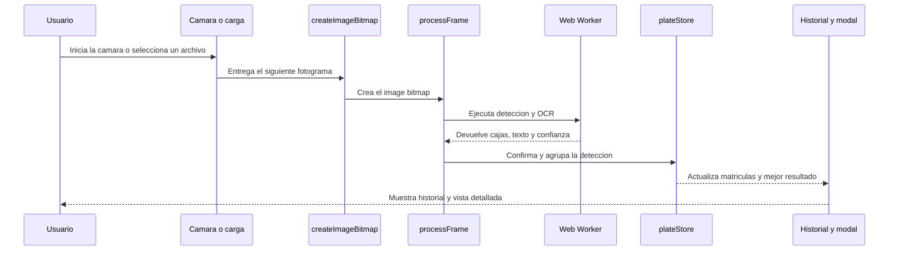

ALPR Vue usa dos modelos de IA que se ejecutan localmente en tu navegador — uno para encontrar matrículas en la imagen y un segundo para leer los caracteres de cada matrícula. Ambos modelos se ejecutan completamente en tu dispositivo, por lo que ningún dato de imagen se envía nunca a un servidor. Cada fotograma de tu cámara o archivo cargado pasa automáticamente por este canal de procesamiento.

## Arquitectura de un vistazo

Este diagrama de secuencia muestra como se mueve un fotograma por la aplicacion desde la captura hasta el resultado guardado.

## El canal de procesamiento

<Steps>
  <Step title="Captura">
    Inicias la cámara o cargas una foto o un archivo de vídeo. Al usar la cámara en vivo, la aplicación captura fotogramas de forma continua a aproximadamente 50 fotogramas por segundo y los introduce en el canal de detección.
  </Step>
  <Step title="Detección de matrícula">
    Un modelo de IA YOLOv9 analiza cada fotograma en busca de regiones de matrículas. Analiza el fotograma completo en una sola pasada y dibuja un recuadro delimitador alrededor de cualquier matrícula que encuentre.
  </Step>
  <Step title="Reconocimiento de texto (OCR)">
    Cada región de matrícula detectada se recorta del fotograma y se pasa a un modelo OCR MobileViT v2. Este modelo lee los caracteres de la matrícula y asigna una puntuación de confianza a cada uno.
  </Step>
  <Step title="Control de calidad">
    Cada resultado se puntúa según cuatro criterios: longitud de caracteres, confianza media, confianza mínima por carácter y formato de matrícula. Solo se conservan los resultados con una puntuación de calidad combinada de 0,7 o superior. Los resultados que no alcanzan este umbral se descartan silenciosamente.
  </Step>
  <Step title="Ventana de confirmación">
    Una matrícula debe detectarse de forma consistente antes de añadirse a tu historial. En modo estándar, la misma matrícula debe aparecer durante 3 segundos continuos. Si la confianza de detección es muy alta (confianza media ≥ 0,8), esta ventana se reduce a 1 segundo.
  </Step>
  <Step title="Agrupación">
    Una vez confirmada, las nuevas detecciones se comparan con las matrículas ya presentes en tu historial. Si dos lecturas de matrícula son al menos un 80% similares (medido por la distancia de cadenas de Levenshtein), se agrupan como la misma matrícula. Esto evita que variaciones menores del OCR — como un único carácter mal leído — creen entradas duplicadas.
  </Step>
</Steps>

<Note>
  Todo el procesamiento se ejecuta en un hilo Web Worker dedicado, separado del hilo principal de la interfaz del navegador. Esto mantiene la interfaz fluida y receptiva incluso mientras los modelos están ejecutándose activamente.
</Note>

## Reglas de validación de calidad de matrículas

Antes de guardar una matrícula en tu historial, debe superar los cuatro criterios siguientes:

| Criterio                        | Requisito                                                                                          |
| ------------------------------- | -------------------------------------------------------------------------------------------------- |
| Longitud                        | 4–10 caracteres                                                                                    |
| Confianza media                 | ≥ 0,7                                                                                              |
| Confianza mínima por carácter   | ≥ 0,5 (ningún carácter individual puede estar por debajo de esto)                                  |
| Formato                         | 2–4 caracteres alfanuméricos, un guion o espacio opcional y luego 2–4 caracteres alfanuméricos más |
| Puntuación de calidad combinada | ≥ 0,7 requerida para almacenar el resultado                                                        |

Cada criterio tiene un peso diferente en la puntuación combinada: la confianza media cuenta un 30%, el formato y la confianza mínima por carácter cuentan un 25% cada uno, y la longitud cuenta un 20%. Una matrícula debe alcanzar 0,7 en total para ser aceptada.
