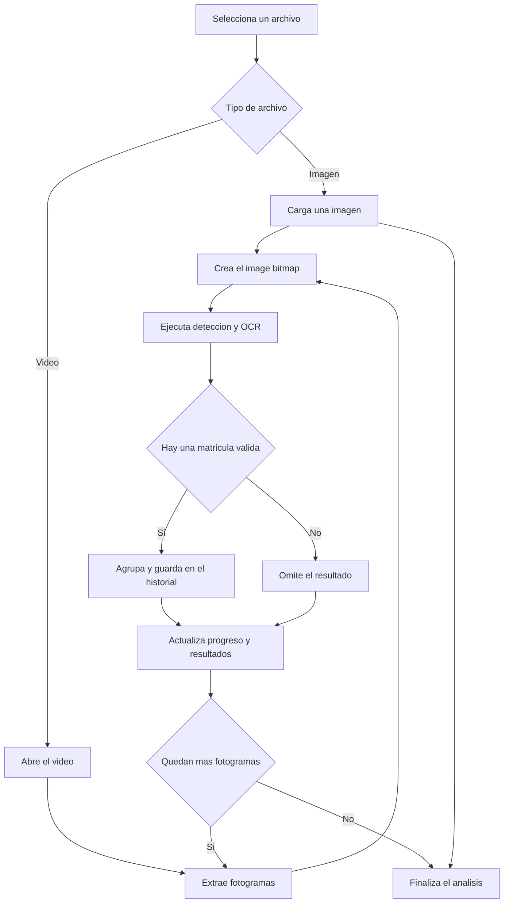

El modo de carga te permite ejecutar el reconocimiento de matrículas sobre archivos que ya tienes — una foto tomada anteriormente, un clip de la cámara del coche o una captura de pantalla de cámaras de seguridad. Usa este modo cuando no puedas apuntar una cámara en directo hacia un vehículo, o cuando quieras procesar grabaciones capturadas en otro momento. Todo sigue gestionándose de forma local en tu dispositivo; ningún archivo se envía a ningún servidor.

## Formatos compatibles

<CardGroup cols="2">
  <Card title="Imágenes" icon="image">
    JPEG, PNG, WebP y otros formatos de imagen habituales compatibles con tu navegador.
  </Card>
  <Card title="Vídeos" icon="video">
    MP4, WebM y otros formatos de vídeo compatibles con el decodificador multimedia integrado en tu navegador.
  </Card>
</CardGroup>

## Cargar un archivo

<Steps>
  <Step title="Haz clic en Cargar archivo">
    En la pantalla principal, haz clic en el botón **Cargar archivo**. Se abrirá un selector de archivos.
  </Step>
  <Step title="Selecciona tu archivo">
    Navega hasta la imagen o vídeo que quieres procesar y confirma tu selección.
  </Step>
  <Step title="Espera el procesamiento">
    La aplicación carga y analiza el archivo. Una superposición de progreso muestra el estado actual. Al finalizar, las matrículas detectadas aparecen en tu historial.
  </Step>
</Steps>

## Flujo de procesamiento de archivos

Este diagrama muestra como ALPR Vue gestiona imagenes y videos despues de elegir un archivo.

## Progreso del procesamiento

Mientras se analiza un archivo, se muestra una superposición de estado en el área de previsualización. Pasa por tres fases:

- **Cargando** — el archivo se está leyendo en la aplicación.
- **Procesando** — el modelo de IA está escaneando el contenido en busca de matrículas.
- **Listo** — el análisis ha terminado y los resultados están disponibles.

Hay un botón **Cancelar** disponible durante el procesamiento si quieres detenerlo antes.

## Galería de muestras

¿No tienes un vehículo cerca? La aplicación incluye contenido de muestra integrado para que puedas explorar todas las funcionalidades de inmediato:

- **10 fotos de coches de muestra** — imágenes reales de vehículos sobre las que puedes ejecutar el reconocimiento de matrículas ahora mismo.
- **3 clips de vídeo de tráfico** — clips cortos que muestran vehículos en movimiento.

Haz clic en **O prueba una muestra** debajo del botón de carga para explorar la galería y cargar cualquier muestra con un solo clic.

<Tip>
  Usa la galería de muestras para familiarizarte con el funcionamiento de la detección, las puntuaciones de confianza y el panel de resultados antes de cargar tus propios archivos.
</Tip>

## Procesamiento de vídeo

Cuando cargas un vídeo, la aplicación procesa **cada fotograma** del clip. Cualquier matrícula que aparezca — aunque sea brevemente — se detecta y se guarda en tu historial. No necesitas pausar el vídeo ni seleccionar un fotograma concreto; la aplicación gestiona el escaneo completo automáticamente.

<Note>
  Los archivos de vídeo grandes o de alta resolución pueden tardar más en procesarse. La velocidad de procesamiento depende del rendimiento de tu dispositivo. Puedes cancelar en cualquier momento y seguir viendo los resultados de los fotogramas que ya se hayan analizado.
</Note>
