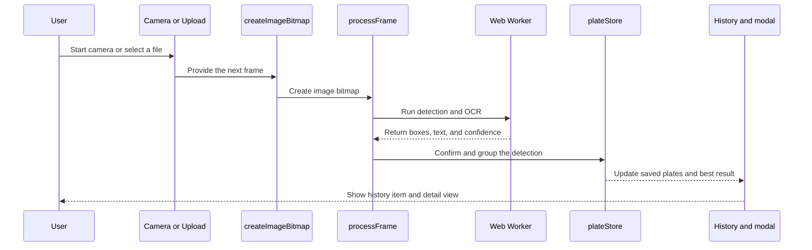

ALPR Vue uses two AI models running locally in your browser — one to find license plates in the image, and a second to read the characters on each plate. Both models run entirely on your device, so no image data is ever sent to a server. Every frame from your camera or uploaded file passes through this pipeline automatically.

## Architecture at a glance

This sequence diagram shows how a frame moves through the app from capture to a saved result.

## The processing pipeline

<Steps>
  <Step title="Capture">
    You start the camera or upload a photo or video file. When using the live camera, the app captures frames continuously at up to approximately 50 frames per second and feeds them into the detection pipeline.
  </Step>
  <Step title="Plate detection">
    A YOLOv9 AI model scans each frame for license plate regions. It analyzes the entire frame in a single pass and draws a bounding box around any plate it finds.
  </Step>
  <Step title="Text recognition (OCR)">
    Each detected plate region is cropped out of the frame and passed to a MobileViT v2 OCR model. This model reads the characters on the plate and assigns a confidence score to each one.
  </Step>
  <Step title="Quality check">
    Each result is scored against four criteria: character length, mean confidence, minimum per-character confidence, and plate format. Only results with a combined quality score of 0.7 or higher are kept. Results that fall below this threshold are discarded silently.
  </Step>
  <Step title="Confirmation window">
    A plate must be detected consistently before it is added to your history. In standard mode, the same plate must appear for 3 continuous seconds. If the detection confidence is very high (mean confidence ≥ 0.8), this window shortens to 1 second.
  </Step>
  <Step title="Grouping">
    Once confirmed, new detections are compared against plates already in your history. If two plate readings are at least 80% similar (measured by Levenshtein string distance), they are grouped together as the same plate. This prevents minor OCR variations — such as a single misread character — from creating duplicate entries.
  </Step>
</Steps>

<Note>
  All processing runs in a dedicated Web Worker thread, separate from the browser's main UI thread. This keeps the interface smooth and responsive even while the models are actively running.
</Note>

## Plate quality validation rules

Before a plate is saved to your history, it must pass all four of these criteria:

| Criterion                    | Requirement                                                                                     |
| ---------------------------- | ----------------------------------------------------------------------------------------------- |
| Length                       | 4–10 characters                                                                                 |
| Mean confidence              | ≥ 0.7                                                                                           |
| Minimum character confidence | ≥ 0.5 (no single character can fall below this)                                                 |
| Format                       | 2–4 alphanumeric characters, an optional hyphen or space, then 2–4 more alphanumeric characters |
| Combined quality score       | ≥ 0.7 required to store the result                                                              |

Each criterion carries a different weight in the combined score: mean confidence counts for 30%, format and minimum character confidence each count for 25%, and length counts for 20%. A plate must reach 0.7 overall to be accepted.
