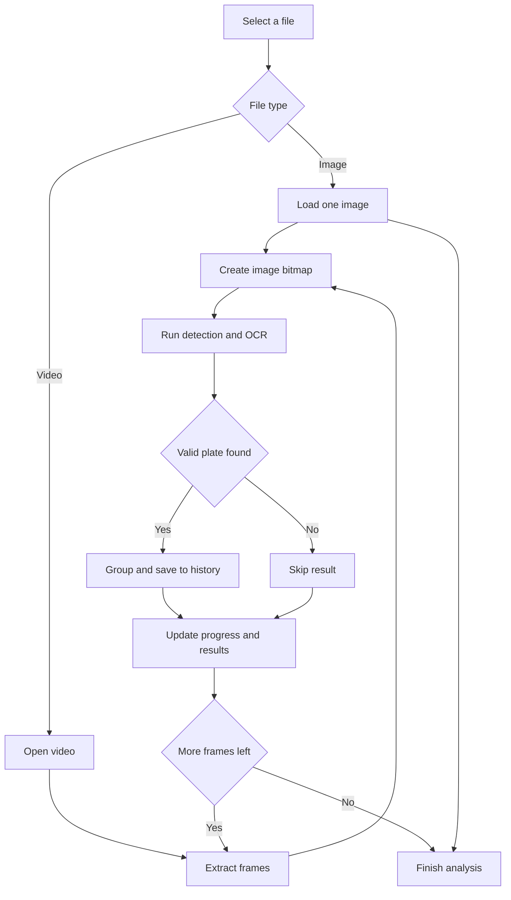

Upload mode lets you run license plate recognition on files you already have — a photo taken earlier, a dashcam clip, or a screenshot from security footage. Use this mode when you can't point a live camera at a vehicle, or when you want to process footage captured elsewhere. Everything is still handled locally on your device; no files are sent to any server.

## Supported formats

<CardGroup cols="2">
  <Card title="Images" icon="image">
    JPEG, PNG, WebP, and other common image formats supported by your browser.
  </Card>
  <Card title="Videos" icon="video">
    MP4, WebM, and other video formats supported by your browser's built-in media decoder.
  </Card>
</CardGroup>

## Uploading a file

<Steps>
  <Step title="Click Upload File">
    On the main screen, click the **Upload File** button. A file picker will open.
  </Step>
  <Step title="Select your file">
    Browse to the image or video you want to process and confirm your selection.
  </Step>
  <Step title="Wait for processing">
    The app loads and analyzes the file. A progress overlay shows the current state. When finished, any detected plates appear in your history list.
  </Step>
</Steps>

## Upload processing flow

This flowchart shows how ALPR Vue handles images and videos after you choose a file.

## Processing progress

While a file is being analyzed, a status overlay is displayed on the preview area. It moves through three states:

- **Loading** — the file is being read into the app.
- **Processing** — the AI model is scanning the content for plates.
- **Done** — analysis is complete and results are ready.

A **Cancel** button is available during processing if you want to stop early.

## Sample gallery

Not near a vehicle? The app includes built-in sample media so you can explore all features immediately:

- **10 sample car photos** — real vehicle images you can run plate recognition on right away.
- **3 traffic video clips** — short clips showing vehicles in motion.

Click **Or try a sample** below the upload button to browse the gallery and load any sample with a single click.

<Tip>
  Use the sample gallery to get familiar with how detection, confidence scores, and the results panel work before uploading your own files.
</Tip>

## Video processing

When you upload a video, the app processes **every frame** of the clip. Any license plate that appears — even briefly — is detected and saved to your history. You don't need to pause the video or select a specific frame; the app handles the full scan automatically.

<Note>
  Large or high-resolution video files may take longer to process. Processing speed depends on your device's performance. You can cancel at any time and still see results from frames that were already analyzed.
</Note>
